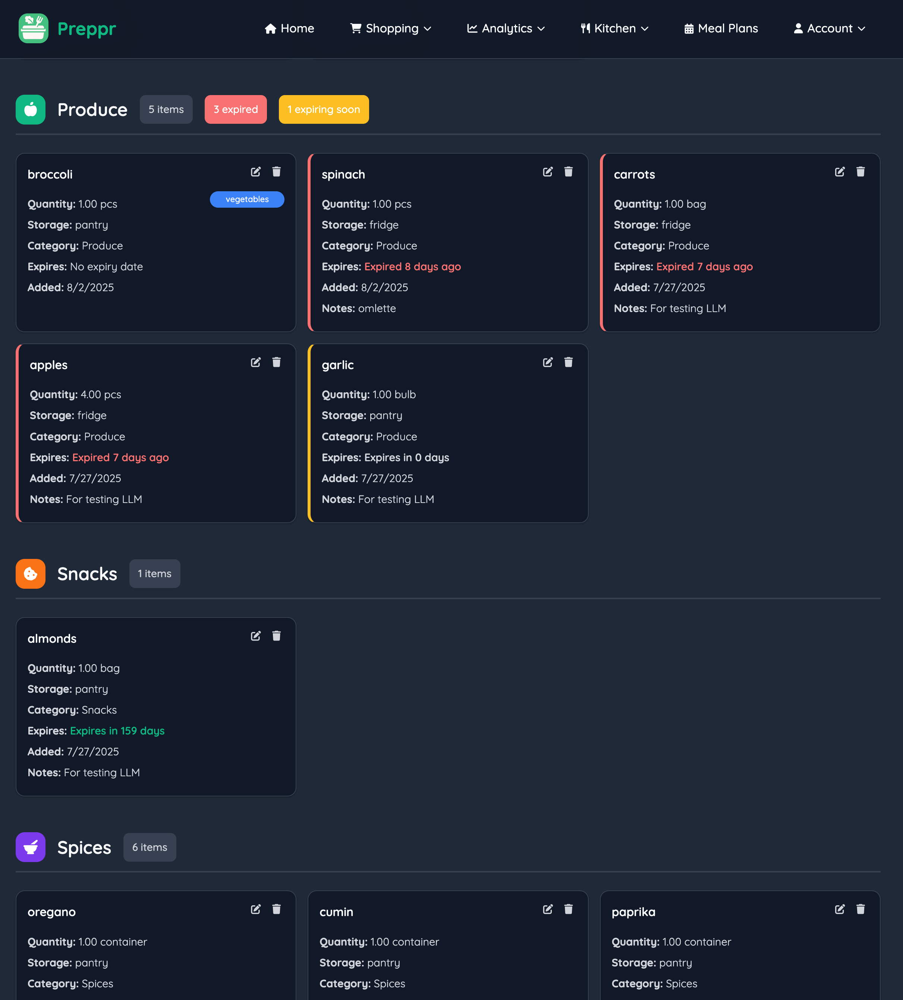
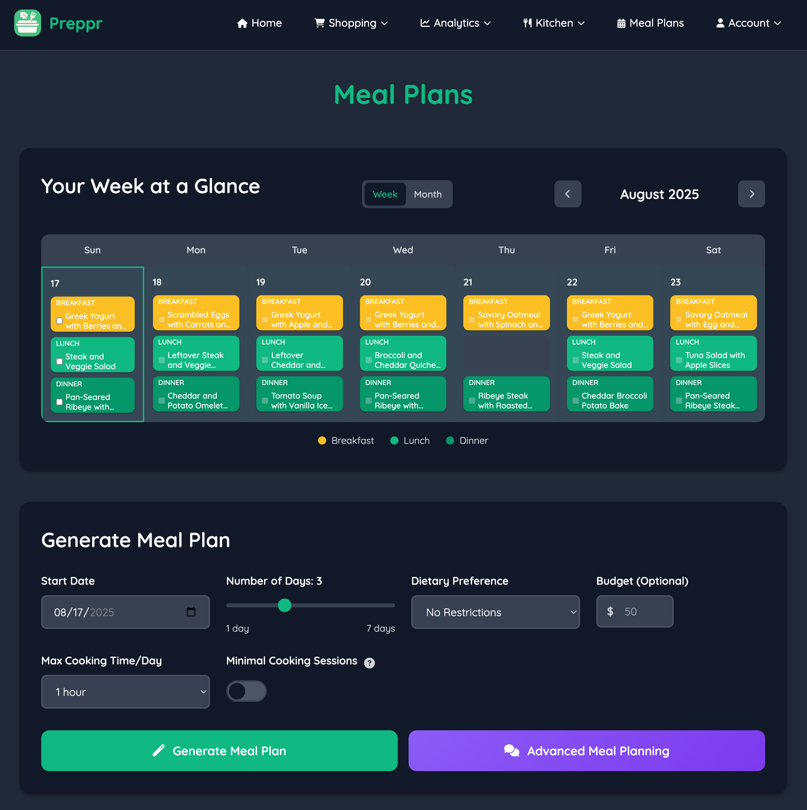
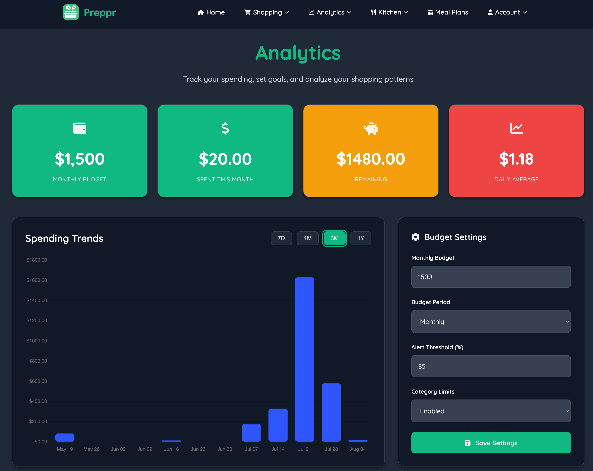

# 🥗 Preppr

**Preppr** is a full-stack, AI-powered meal prep assistant that helps users plan, prep, and stay consistent with meals — while saving time, money, and reducing food waste.  

> **Prep smarter. Save time. Eat better.**  

🔗 **Live Demo:** [https://preppr.co](https://preppr.co)  

---

## 🚀 Features

- 🧠 **AI-Powered Meal Planning**  
  Generate personalized weekly meal plans using **Google Gemini** based on pantry items, dietary goals, and time constraints.  

- 📦 **Pantry & Expiration Tracking**  
  Track pantry items and predict expiration dates with AI to reduce waste.  

- 💸 **Smart Shopping & Budgeting**  
  Auto-generate shopping lists, calculate cost per meal, and visualize monthly budget progress.  

- ⏰ **Batch Cooking Scheduler**  
  Group meals into efficient cooking sessions to save time.  

- 📊 **Analytics Dashboard**  
  View meal prep consistency, budget savings, and nutrition insights.  

---

## 🧰 Tech Stack

| Layer       | Technology                                |
|-------------|-------------------------------------------|
| **Backend** | Python (Flask), Gunicorn                  |
| **Frontend**| JavaScript, HTML, CSS (modular templates) |
| **Database**| MySQL (AWS RDS)                           |
| **Infra**   | Docker, AWS App Runner, RDS               |
| **AI**      | Google Gemini (LLM API), Nutritionix API  |

---

## 🏗️ Architecture Overview

```
   [Frontend: HTML/CSS/JS]  
            │  
   [Flask API Backend] ──> [MySQL (AWS RDS)]  
            │  
    [Gemini LLM API + Nutritionix API]  
            │  
   [Budget + Analytics Engine]  
```
## ⚠️ Notice 
- This is a **public showcase** of Preppr’s codebase.  
- Certain files (secrets, API integrations, proprietary prompts, and production deployment scripts) have been intentionally omitted or stubbed to protect sensitive information.

---

## 💡 Example Use Cases

- “Suggest a weekly meal plan I can prep on Sunday under 2 hours.”  
- “What can I make with chicken, spinach, and rice?”  
- “Show meals that use items expiring this week.”  
- “Track my budget progress and spending patterns.”  

---

## 📍 Status

Preppr is under active development and deployed via **AWS App Runner + RDS**.  
Future improvements: CI/CD pipeline, caching layer, and mobile-optimized UI.  

---

## 📸 Screenshots

### Pantry


### Meal Plan Calendar


### Analytics


---

## 📄 License

MIT License © 2025 Michael Wang  
